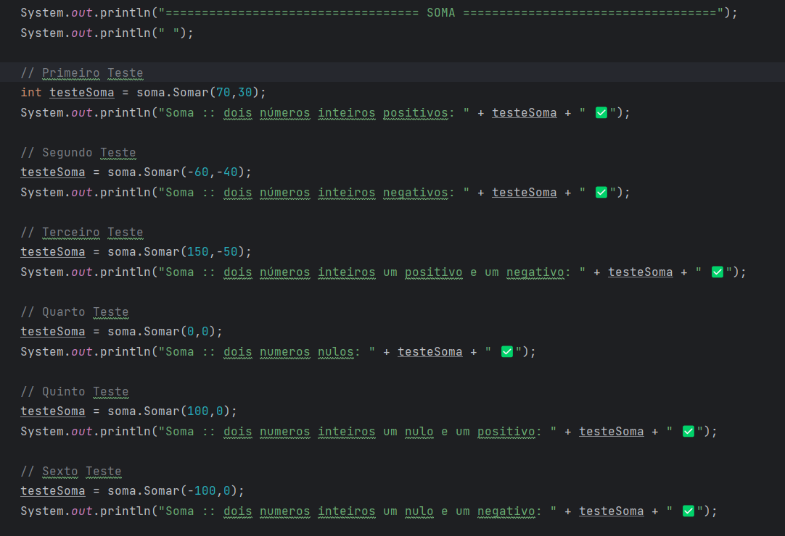

# Calculadora
## Descrição
A Calculadora foi desenvolvida no IntelliJ IDEA utilizando o método *System.out.println(" ")* realizando impressões no console

## Funcionalidades
Este código Java é um exemplo de teste de unidade que avalia quatro operações matemáticas fundamentais: soma, subtração, multiplicação e divisão. O objetivo é verificar se as classes correspondentes conseguem realizar essas operações de maneira precisa em diversos cenários, abrangendo números positivos, negativos e nulos. Como parte da abordagem de testes unitários, o usuário deve elaborar cálculos com respostas conhecidas, 
pois os testes serão realizados a partir dos dados que o usuário forneceu, com o intuito de realizar testes que ajudam a garantir que as funções de cálculo matemático estejam funcionando corretamente.

## Última atualização 07/09/2023
