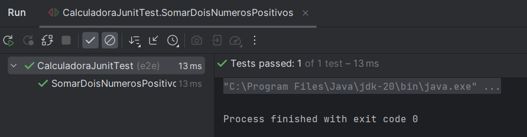
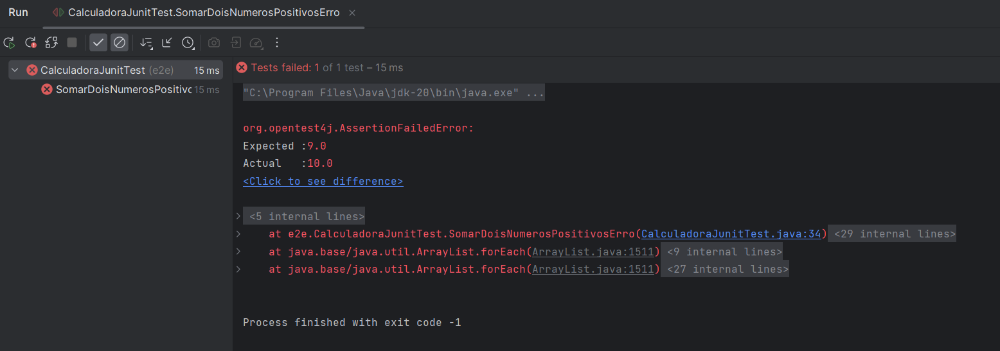

# Calculadora
## Descrição
A calculadora foi desenvolvida no IntelliJ IDEA utilizando a biblioteca da JunitTest e consiste em uma calculadora com implementações de testes.

## Funcionalidades
Este código Java é um exemplo de teste de unidade que avalia quatro operações matemáticas fundamentais: soma, subtração, multiplicação e divisão. O principal objetivo é verificar se as classes correspondentes podem executar essas operações de maneira precisa em várias situações, abrangendo números positivos, negativos e nulos. Para realizar esses testes, a biblioteca JUnitTest é incorporada ao projeto.

Como parte da abordagem de testes unitários, os usuários são encorajados a criar cálculos com respostas conhecidas. Esses cálculos servirão como base para os testes, ajudando a garantir que as funções de cálculo matemático estejam funcionando corretamente. Essa integração com o JUnitTest torna o processo de teste mais eficiente e preciso.

## Última atualização 07/09/2023